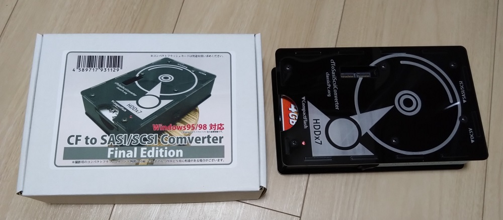

# CF to SASI/SCSI Converter Final Edition

* メーカー 
  * [クラシックPC研究会](https://classicpc.org/)さん
* 製品名
  * CF to SASI/SCSI Converter Final Edition
  * (型番: CLPC-SxSI200EXB か？)

コンパクトフラッシュメモリを、SASI/SCSIハードディスクとして利用するための装置。
クラシックPC研究会さんの現行品(2023年)「変換番長PRO」も類似の装置だが、
そちらはコンパクトフラッシュに格納したHDDイメージファイルを
SASI/SCSIドライブとしてPCに見せるのに対し、
本装置はHDDイメージファイルを介在させずに単純に直接コンパクトフラッシュを
SASI/SCSIハードディスクとして見せていると思われる。

VAではSASIハードディスクとして利用可能。起動も可能。SCSIとしても利用可能と思われる。





※ コンパクトフラッシュは別途購入が必要。

## SASI ハードディスクとしての利用

### 構成

以下の構成で動作した。

* コンパクトフラッシュ
  * Transcend CompactFlash 133 2GB TS2GCF133
* SASI I/F
  * Logitech LHA-12ES
* SCSIケーブル
  * アンフェノールフルピッチ 50ピン - アンフェノールハーフピッチ50ピン
* SCSIのターミネータ
  * アンフェノールハーフピッチ
* PC-88VA2

CF to SASI/SCSI Converter は、一般的な98用SCSIハードディスクと同様にアンフェノールハーフピッチ50ピンの
コネクタを2つ備えている。一方にケーブルを、もう一方にターミネータを接続。

ターミネータがない場合は、付属のパッシブターミネータ用抵抗で代替可能と思われる。
ただし、説明書ではコネクタへのターミネーター取り付けを推奨している。

98用SASI I/Fは多くの場合フルピッチのアンフェノール50ピンコネクタを備えるため、接続には
アンフェノールフルピッチ 50ピン - アンフェノールハーフピッチ50ピン のケーブルが必要だが、現行製品にはなさそう。
現行品の範囲では次の組み合わせで代替できそう。
- 変換コネクタ アンフェノールフルピッチ50ピン - ピンタイプ50ピン (例 [サンワサプライ AD-P50CK](https://www.sanwa.co.jp/product/syohin?code=AD-P50CK))
- SCSIケーブル ピンタイプ50ピン - アンフェノールハーフピッチ50ピン (例 [サンワサプライ KB-SHP1K](https://www.sanwa.co.jp/product/syohin?code=KB-SHP1K) )


### 機器設定

CF to SASI/SCSI Converter

```
DIPSW1  1   2   3   4   5   6   7   8
        ON  ON  OFF OFF ON  OFF OFF OFF
        |   |   |   |           |   |
        |   |   |   |           |   BUS POWER OFF
        |   |   |   |           NECインクワイアリOFF
        |   |   |   <---------> 容量制限 40MB 
        |   |   98番長モードOFF
        |   256byte/セクター
        SASI

DIPSW2  1   2   3   4   5   6   7   8
        ON  OFF OFF OFF OFF OFF OFF OFF
        |
        ID0 を割り当て

⇒ LUNは常に0/1の2つとなる仕様のため、以下の構成になる。
  ただし、VAで認識されるのはLUN0のみか？
    ID0 LUN0: 40MByte
    ID0 LUN1: 40MByte
```


LHA-12ES

```
★TODO
```

### 接続確認

* コンパクトフラッシュをCF to SASI/SCSI Converterに接続し、CF to SASI/SCSI Converterの電源をON。
  CF to SASI/SCSI ConverterのLEDは点灯後にすぐ消灯する。
  これが点滅する場合、DIPSWの設定に問題があるか(コンパクトフラッシュの容量がハードディスクドライブ台数分に満たないなど)、相性問題があるとのこと。
* VAに接続、PC-Engineを起動、認識しているか確認。⇒ [SASIハードディスク](../sasi_hdd/sasi_hdd.md)参照。

### その後の操作

一般のSASIハードディスクと同様。⇒ [SASIハードディスク](../sasi_hdd/sasi_hdd.md)参照。

## TODO

* LHA-12ES のジャンパ マニュアルで確認。
