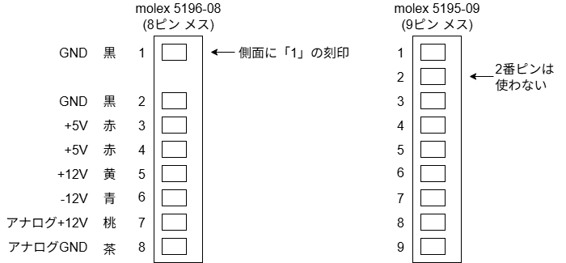

# ATX電源をPC-88VA2/3へ接続するための変換ケーブル

## 概要

電源故障時の代替や、メンテナンス時の一時的な電源確保などのため、自作PC用のATX電源をVA2/3の
メイン基板に接続する変換ケーブルを製作する。

- 電源ON/OFFはATX電源上のスイッチを利用する。VAのスイッチは利用しない。
- VAの5インチ/3.5インチFDDの電源は、ATX電源から出ているペリフェラル4ピン/FDD4ピンネクタをつなぐ想定。(製作する変換ケーブルの対象外)
- ATX用電源延長ケーブルを加工して作成する。

## 設計

コネクタ間の配線は次の図のとおり。

* この図は、コネクタを上から（ワイヤーが差し込まれる側から）見ている。

* VAは、デジタル系の電源(1～6)とアナログ系(7,8)が区別されているが、ATX電源には区別がない。
  `7 アナログ+12V`, `8 アナログGND` にはATX電源側の `+12V`, `GND` をそれぞれ接続する。
* ATX電源は `16 PS_ON` を `GND` に接続するこで電源ONとなる。今回は、電源背面のスイッチでON/OFFする使い方を想定し、`16 PS_ON` を `17 GND`に固定的に接続する。

### J1: VA側コネクタ

#### ハウジング

| No. | メーカー  | 型番      | 備考                                                                                    |
|-----|-------|---------|---------------------------------------------------------------------------------------|
| 1   | Molex | 5196-08 | VA2の電源ユニットで使用されているコネクタ。入手不可。                                                          |
| 2   | Molex | 5195-09 | No.1の代替として利用可能。2番ピンをスキップして使う。  → [マルツオンライン](https://www.marutsu.co.jp/pc/i/45852/) |

#### コンタクト

上記ハウジングに対応するコンタクトは次のとおりだが、ATX用電源延長ケーブルに使われているワイヤーの太さ(AWG 18)を考えると5194のみが選択肢となる。

| No. | メーカー  | 型番                | 芯線サイズ     | 備考                                                              |
|-----|-------|-------------------|-----------|-----------------------------------------------------------------|
| 1   | Molex | 5194T / 5194PBT   | AWG 18～24 | 連鎖状   → [マルツオンライン](https://www.marutsu.co.jp/pc/i/16227814/) |
| 2   | Molex | 5194TL / 5194PBTL | AWG 18～24 | バラ状   → [モノタロウ](https://www.monotaro.com/p/0856/1025/)       |
| 3   | Molex | 5225T             | AWG 22～28 | 連鎖状, 入手不可。                                                      |
| 4   | Molex | 5225TL            | AWG 22～28 | バラ状, 入手不可。                                                      |

- 材質
  - ～T: 黄銅
  - ～PBT: りん青銅

### J2: ATX電源側コネクタ

ATX用電源延長ケーブルの電源側コネクタ（24ピン メス）を利用。
ピン配列は[ニプロン社の解説][nipron-atx]などを参照。

## 製作

利用した部材

- ATX電源側コネクタ
  - [Bullet 電源延長ケーブル PWATXE01M](https://www.yodobashi.com/product/100000001001619905/)
    - 電源側 ATX24ピン
    - ケーブル長 45cm
    - 芯線サイズ AWG 18
- VA側コネクタ
  - ハウジング: Molex 5195-09
  - コンタクト: 5194TL
- ATX電源
  - [Silver Stone FX350-G](https://www.silverstonetek.com/jp/product/info/power-supplies/FX350-G/)
  
工具

- 圧着ペンチ
  - [エンジニア PA-24](https://www.nejisaurus.engineer.jp/product-page/pa-24-%E7%B2%BE%E5%AF%86%E5%9C%A7%E7%9D%80%E3%83%9A%E3%83%B3%E3%83%81)

製作

- ATX電源延長ケーブルのマザーボード側コネクタ(オス)を切り離す。
  - 使わない線は、電源側コネクタの近くで切断し、熱収縮チューブなどで絶縁。
  - ※ ハウジングからピンが引き抜けるとベストだが、方法が不明。
- ATX電源側のワイヤー `16 PS_ON` と `17 GND` とを接続。
  - はんだ付け前に熱収縮チューブを通し、はんだ付け後に収縮させる。
- 残りのワイヤーにコンタクト 5194TL を圧着。
  - コンタクトの寸法は下図のとおり。 ([molexの資料][molex-connector]より)
    - Z-Z面 → 圧着ペンチの w2.2mm を使用 (w1.9mmだと圧着後にワイヤーが抜けることがあった)
    - Y-Y面 → 圧着ペンチの w2.2mm を使用 (本当はもう一回り大きいほうが良いのだろうか？)

      

      
  
      

- コンタクトをハウジングに差し込む。

製作したケーブル

## 関連資料

- [molex パワー用 電線対基板用コネクター][molex-connector]
- [Nipron ATX電源のピンアサインについて教えて下さい][nipron-atx]

[molex-connector]: https://www.marutsu.co.jp/contents/shop/marutsu/datasheet/MOLEX_E_PWR_WtoB.pdf
[nipron-atx]: https://www.nipron.co.jp/consultation/qa_index.cgi?mode=a&id=183
