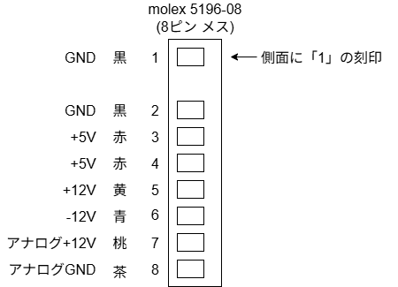

# PC-88VA2/3 電源ユニット

## 概要

* 新電元工業 NPS09A

電源ユニットからの出力

* VA2/3メイン基板向け 1本
  * molex 5196-08
    * 
* 5インチ FDD 向け 2本
  * 5V, 12V, GND
* 3.5インチ FDD 向け 1本
  * 5V, 12V, GND
* 背面ファン向け 1本
  * 12V, GND

## 回路図

独自に調査したものであり、不完全です。利用者の責任において利用ください。

* [回路図PDF (二次側のみ)](./88va2-power-circuit.pdf)
* [基板パターンPDF (二次側のみ)](./88va2-power-circuit-pcb.pdf)
* [KiCad 9.0 プロジェクト](https://github.com/xmaz-project/88va2-power-unit)

## 部品
### 電解コンデンサ

* メイン基板 一次側

| 番号  | 耐圧(V) | 容量(F) | 温度(℃) |                |
|-----|-------|-------|-------|----------------|
| C50 | 200   | 820u  | 85    | nichicon LR(M) |

* メイン基板 二次側

| 番号  | 耐圧(V) | 容量(F)  | 温度(℃) |                      |
|-----|-------|---------|-------|----------------------|
| C01 | 16    | 5600u   | 105   | ELNA LongLife RSG(M) |
| C02 | 16    | 5600u   | 105   | ELNA LongLife RSG(M) |
| C04 | 10    | 1200u   | 105   | ELNA LongLife RSG(M) |
| C06 | 50    | 1u      | 105   | Marcon               |
| C07 | 35    | 4.7u    | 105   | Marcon               |
| C11 | 25    | 470u    | 105   | ELNA LongLife RSG(M) |
| C12 | 16    | 330u    | 105   | Marcon               |
| C21 | 25    | 1500u   | 105   | ELNA LongLife RSG(M) |
| C22 | 25    | 470u    | 105   | ELNA LongLife RSG(M) |
| C24 | 50    | 1u      | 105   | Marcon               |
| C25 | 50    | 1u      | 105   | Marcon               |
| C31 | 25    | 330u    | 105   | Marcon               |
| C32 | 16    | 330u    | 105   | Marcon               |

* SUB1

なし

* SUB2

| 番号  | 耐圧(V) | 容量(F) |     |        |
|-----|-----|-----|-----|--------|
| C45 | 25 | 33u | 105 | Marcon |

### コネクタ

| 番号   |                          |
|------|--------------------------|
| CN10 | AC100V入力                 |
| CN11 | 電源出力(ファン)                |
| CN12 | 電源出力(VA2/3メイン基板用？) |
| CN13 | 電源出力(FDD用？)              |

### その他

| 番号      |                      |                                                                                                      |
|---------|----------------------|------------------------------------------------------------------------------------------------------|
| F40 | ヒューズ                 | 250V 5A                                                                                              |
| M21 | シャントレギュレータ？          | 松下 1431                                                                                              |
| Q140 | Switching Transistor | Fuji Electric 富士電機 [2SC4275](https://www.alldatasheet.com/datasheet-pdf/pdf/88111/FUJI/2SC4275.html) |
| PC01 PC02 PC21 | Photo Coupler        | NEC [PS2401](https://www.scribd.com/document/652788588/PS2401A-1-NEC-pdf) |

