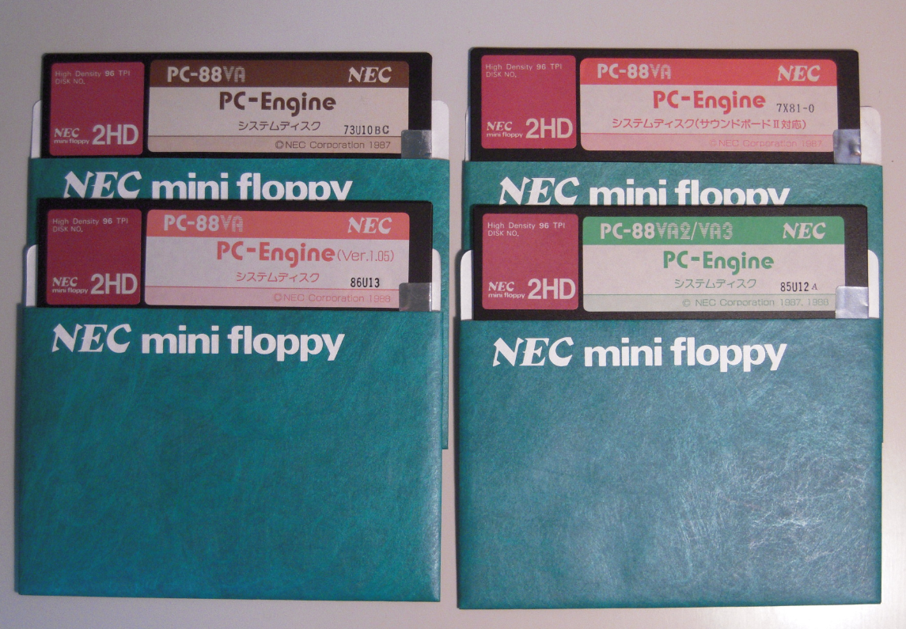

# PC-Engine システムディスク

V3モードを起動するには、システムディスクが必要。市販のソフトウェアを使うのであれば、基本的には必要ない。システムが含まれているため。

## システムディスクの種類
PC-Engineのシステムディスクは、配布の経緯により、5種類ある。

| 配布方法 | PCENGINE.SYSのタイムスタンプの例 | 備考 |
|----------|---------------------------------|------|
| 初代VA添付 | 87-03-25 | |
| Ver 1.05 | 88-06-10 | 初代VA向けに、VA2/3で新規追加された機能の一部を提供することが目的と思われる。<br>初代VAのユーザー登録をするとNECから送付された模様。「PC-88VA用PC-Engine機能強化のお知らせ」というタイトルのマニュアルが添付。 |
| サウンドボード2添付 | 87-10-20 | 初代VAでもBASICでサウンドボード2に対応した命令が利用可能になる。PLAY文でのFM6和音対応、RHYTHM文追加、PCM関連命令追加など。BIOSも拡張されているかは要確認。(MUSIC BIOS, ADPCM BIOS) |
| VA2/3添付 | 88-08-29 | 知る限りでは94-08-02が最新 |
| VA-91添付?? | | (PC-VANの記事を見る限り存在している模様) |




また、システムディスクをNECに送付することで更新版に書き換えてもらうことが可能だった。起動に必要な4ファイル(後述)については、最終的には上記5種類を区別せずに、共通のバイナリに統合されたと思われる(Ver1.05とVA2/3添付のどちらをNECで更新してもらった場合でも、タイムスタンプ・ファイルサイズが同じバイナリが提供されたようだ)。
基本的に、どのシステムディスクも、初代VA, VA2/3のどちらでも利用可能。

## システムディスクに含まれるファイル

起動に必要なファイル。

| ファイル | 説明 |
|----------|------|
| ENGINEIO.SYS | フロッピーディスクBIOSパッチ？ |
| PCENGINE.SYS | その他BIOS/PC-Engineパッチ？ |
| ADVGBIOS.SYS | 拡張グラフィックBIOS |
| PCENGINE.COM | SHELL |

最新タイムスタンプは以下のとおりと思われる。
```
ENGINEIO.SYS     4096 87-09-10 19:48:18
PCENGINE.SYS    87434 94-08-02 22:19:36
ADVGBIOS.SYS    30956 88-03-10 14:40:58
PCENGINE.COM        5 93-08-12 00:00:00
```
その他の、外部コマンド、サンプルプログラム、ユーティリティなど。


| ファイル | 説明 | 初代VA添付 | SB2添付 | 1.05 | VA2/3 |
|----------|------|:----------:|:--------:|:----:|:-----:|
| PCENGINE.SB2 | | － | － | ○ | － |
| NECGAIJI.DAT | | ○ | ○ | ○ | ○ |
| MAPSYM.FNT | | － | － | － | ○ |
| MARUMOJI.FNT | | － | － | － | ○ |
| CHKDSK.COM | | ○ | ○ | ○ | (内蔵コマンド) |
| HDFORM.COM | | ○ | ○ | ○ | ○ |
| ATTRIB.COM | | － | － | ○ | (内蔵コマンド) |
| BACKUP.COM | | － | － | ○ | (内蔵コマンド) |
| DISPLAY.COM | | － | － | ○ | (内蔵コマンド) |
| LABEL.COM | | － | － | ○ | (内蔵コマンド) |
| PLAY.COM | | － | － | ○ | (内蔵コマンド) |
| PR801.COM | | － | － | ○ | ○ |
| RENDIR.COM | | － | － | ○ | (内蔵コマンド) |
| SORTDIR.COM | | － | － | ○ | (内蔵コマンド) |
| SYS2.COM | | － | － | ○ | － |
| WHEREIS.COM | | － | － | ○ | (内蔵コマンド) |
| CALC.EXE | | － | － | － | ○ |
| NETV3.EXE | | － | － | － | ○ |
| TELDIR.DAT | | － | － | － | ○ |
| VA11SAMP.BAS | | ○ | ○ | － | ○ |
| KEYBDSAMP.BAS | | － | ○ | － | ○ |
| RTHMSAMP.BAS | | － | ○ | － | ○ |

Ver1.05のSYS2コマンドについては以下のドキュメントを参照。

* [88VAユーザーズクラブQ&A集 1.20 SYS2.COMを使ってもSB2対応のシステムが作れません。](http://www.pc88.gr.jp/vafaq/view.php/article/88va/vafaq/22)

## PC-Engineのバージョン

起動時に表示されるPC-Engineのバージョン番号は、本体とシステムディスクとの組み合わせにより、以下のとおりとなる。

| 本体 | システムディスク | バージョン |
|------|------------------|------------|
| 初代VA | 初代VA添付, SB2添付 | 1.0 |
| 初代VA | Ver1.05, VA2/3 | 1.05 |
| 初代VA+バージョンアップボード<br>VA2/3 | どれでも | 1.1 |