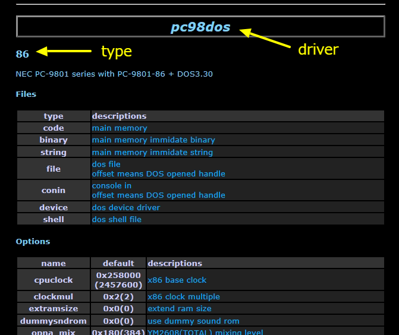

# hootでPMDの楽曲データを演奏

パソコン通信などで配布されたPMDの楽曲データや、PMDを利用した各種市販・同人ソフトの楽曲データをhootに登録し、リストから選択して演奏できるようにする方法のまとめ。PC-9801/PC-88VAのPMDについて。
PMD利用方法(実機)の知識が前提。

## PMDとは

KAJA氏によるPC-9801用FM音源ドライバ。PC-88VAやFM TOWNSなどもサポート。

* 公式サイト
    * [http://www5.airnet.ne.jp/kajapon/tool.html]()


## hootとは

サウンド機能に特化したエミュレータ。Windows用。パソコンやゲーム機など様々な機種での楽曲演奏を再現。
画面は、上半分にチャンネル数分のピアノの鍵盤、下半分に楽曲のリストという、パソコン少年少女が一度は憧れた、あのユーザーインタフェース。

* 公式サイト
    * [http://dmpsoft.s17.xrea.com/hoot/]()


## hootの仕組み(PMD利用の観点で)

hootは、音源チップとパソコン(ゲーム機)本体のエミュレータの集合体。適切な音源チップ、パソコン本体を選択し、
その上で音源ドライバを動かし、楽曲データを読み込ませることで、演奏を実現する。

演奏に関わるコンポーネントは次のとおり。たぶん。

1. 音源チップのエミュレータ (hoot内部)
    * OPN(初代VA, 9801-26K搭載のもの), OPNA(VA2/3, 86ボード搭載のもの)をはじめ、様々なものをhootが用意している。
2. パソコン・ゲーム機本体のエミュレータ (hoot内部)
    * 98, 88, VAなど含めこちらも様々なものをhootが用意している。
    * 98/VAであれば、MS-DOS/PC-Engineのシステムコールなどもエミュレートしてくれるらしい。
3. 音源ドライバ
    * 本記事でいえばPMD
4. 楽曲データ
    * PMDの.Mファイルのほか、その.Mが必要とするPCMデータなども。
5. "hoot用ドライバ"
    * hootからの演奏開始・停止などの指示を受けて、音源ドライバをコントロールするプログラム。
    * パソコン・ゲーム機本体のエミュレータ上で動作する。(本記事の場合はMS-DOS/PC-Engine用のプログラムということになる。)

hootで「ドライバー」というと1, 2 を指すことも、5を指すこともある模様。

## hootのインストール

最低限必要な作業は:

* 公式サイトよりダウンロード、展開し、お好みのディレクトリへ配置。主要ファイル・ディレクトリは以下のような構成になる。

    ```text
    <hootインストール先>
    |   hoot.exe
    |   hoot.ini
    |   hoot.xml
    |
    +---etc
    +---outs
    +---skin
    \---xml
    
    ```

* hoot.exe を起動し、鍵盤画面が表示されるか確認する。
* DirectX9がないと小さいエラーダイアログが出る。
    * DirectX11が入っていれば良いというわけではないらしい。
    * 無ければ入手してインストール。
        * [https://www.microsoft.com/ja-jp/download/details.aspx?id=35]()


## hootへの楽曲登録

### 概要

hootへ楽曲を登録するには、次の2つのファイルの作成が必要。

* アーカイブ(ZIPファイル)
    * 音源ドライバ、楽曲データ、hoot用ドライバなど、必要なファイルをZIP圧縮したもの。
* XMLファイル
    * 音源チップ/パソコン本体エミュレータの指定・設定、音源ドライバや楽曲データのファイル一覧
    
### 音源チップ/パソコン本体エミュレータの名称の確認

* drivers.xmlを生成させる。

    ```text
    hoot.exe -list
    ```

* drivers.xml を Internet Explorer で開き、driverとtypeの名前を確認。IEのXSLTの機能を使っているため、IEで開く必要あり。
    

本記事の目的で言えば、利用するのは
   * 98用のPMDなら
       * driver: pc98dos
           * type: opn, 86 など音源にあわせて選択
   * 88VA用のPMDなら
       * driver: pc88vados
           * type: opn, opna から音源にあわせて選択


### PMDの入手

* 市販・同人ソフトであれば、そのディスクから持ってくるか
* 本家サイトから PMD98 Ver 4.8o をダウンロード。  
      * PMD.COM(PC-9801+OPN用)以外は、自己解凍差分PMD48O.COMの実行により得られるが、64bit Windowsではもはや.comの実行はサポートされないため、実機やエミュレータでの実行が必要。

### PMD向けの"hoot用ドライバ"の入手

黒羽製作所さんのサイトからダウンロード。

* hoot公式xmlメンテナンス > フリーソフト系ドライバ > PMD/PMDB2/PMD86/PMDPPZ(E)/PMDIBM/PX用ドライバ
    * [http://kurohane.net/hoot/]()

展開し、README.TXT を熟読。
    
### アーカイブファイル(ZIP)の作成

以降、PC-9801, PMD.COM を利用する場合を例に説明。

* 以下のファイルを全部入れた、ZIPファイルを作成。
   * PMD.COM (音源ドライバ本体)
   * PMD_98.COM (PMD向けhoot用ドライバ)
   * *.M (PMD楽曲ファイル)
* 楽曲ファイルがPCMを利用している場合は、以下も入れる
   * PMDPCM.EXE (PCMをロードするプログラム。PMDに添付。)
   * *.PPC などPCMファイル
* ZIPファイル内部にサブディレクトリを持たないようにする。

要は、実機でPMD演奏時に使うプログラムとデータファイルはすべてZIPに含める。

なお、PC-88VA用のPMDの場合でも、MSEなどは不要。hoot側でMS-DOSシステムコールをエミュレートしてくれるようだ。

### XMLファイルの作成

\<hootインストール先>\xml にあるXMLを参考に作成。例として、"sample.xml" という名前で作成。

```xml
<?xml version="1.0" encoding="Shift_JIS"?>
<?xml-stylesheet type="text/xsl" href="hoot.xsl"?>
<!DOCTYPE gamelist [
    <!ELEMENT gamelist (game|bind|childlists)*>
    <!ATTLIST gamelist date CDATA #IMPLIED>
    <!ELEMENT childlists (list)*>
    <!ELEMENT list (#PCDATA)>
    <!ELEMENT bind (exts,driver,options?)>
    <!ELEMENT exts (ext)*>
    <!ELEMENT ext (#PCDATA)>
    <!ELEMENT game (name,driver,driveralias?,options?,romlist?,titlelist?)>
    <!ELEMENT name (#PCDATA)>
    <!ELEMENT driver (#PCDATA)>
    <!ATTLIST driver type CDATA #IMPLIED>
    <!ELEMENT driveralias (#PCDATA)>
    <!ATTLIST driveralias type CDATA #IMPLIED>
    <!ELEMENT options (option)*>
    <!ELEMENT option EMPTY>
    <!ATTLIST option name CDATA #REQUIRED
            value CDATA #REQUIRED>
    <!ELEMENT romlist (rom)*>
    <!ATTLIST romlist archive CDATA #IMPLIED>
    <!ELEMENT rom (#PCDATA)>
    <!ATTLIST rom type CDATA #REQUIRED
            offset CDATA #IMPLIED
            crc32 CDATA #IMPLIED>
    <!ELEMENT titlelist (title|range)*>
    <!ELEMENT title (#PCDATA)>
    <!ATTLIST title code CDATA #REQUIRED
            type CDATA #IMPLIED>
    <!ELEMENT range (#PCDATA)>
    <!ATTLIST range min CDATA #REQUIRED
            max CDATA #REQUIRED
            extcode CDATA #IMPLIED>
    ]>
<gamelist date="2020/01/01"> ★1
    <game>
        <name>サンプルゲーム</name> ★2
        <driver type="opn">pc98dos</driver> ★3
        <driveralias type="sample">サンプル</driveralias> ★4
        <options>
            <option name="funcvect" value="0x7e"/> ★5
        </options>
        <romlist archive="sample"> ★6
            ★7
            <rom type="file" offset="-1">PMD_98.COM</rom>
            <rom type="file" offset="-1">PMD.COM</rom>
            <rom type="file" offset="0x10">VARPG02.M</rom>
            <rom type="file" offset="0x11">VARPG15.M</rom>
            ★8
            <rom type="shell" offset="0">pmd # /K</rom>
            <rom type="shell" offset="0">pmd_98</rom>
        </romlist>
        <titlelist> ★9
            <title code="0x10">サンプル楽曲1</title>
            <title code="0x11">サンプル楽曲2</title>
        </titlelist>
    </game>
</gamelist>
```

* ★1 gamelistタグより前の部分は、xmlディレクトリ内の他のXMLファイルをそのままコピーする。
* ★2 アルバム名に相当する名前。楽曲一覧に反映される。
* ★3 利用する音源チップ/パソコン本体のエミュレーション。drivers.xml を参照して確認したもの。
* ★4 ゲームメーカーやアーティスト名に相当する名前。楽曲一覧のグループ分けに反映される。
* ★5 音源チップ/パソコン本体のエミュレーションに関する設定
    * 設定項目は drivers.xml で確認する。
    * hoot用ドライバPMD_98.COM利用時は、そのREADME.TXTに記載のとおり、上記のようにfuncvectに0x7eを指定する必要あり。
* ★6 archive=には、アーカイブファイル(ZIP)のファイル名(拡張子除く)を指定。
* ★7 エミュレータ上の仮想的なファイルシステムに置くファイル名を列挙。
    * アーカイブファイル(ZIP) に格納したファイルがすべて並ぶはず。
* ★8 エミュレータ上で実行するプログラムの指定。バッチファイルに相当。実行する順に記述。
    * PMDPCMでPCMをロードするなど必要であれば追加。
    * hoot用ドライバPMD_98.COMは最後に指定。
* ★9 楽曲リスト。楽曲一覧に反映される。

\<rom type="file"> について

* offset は、ファイルに割り当てるDOSのファイルハンドルを指定しているらしい。多分以下の指定で動く。正確なところはhoot用ドライバPMD_98.COMの仕様による。
    * 楽曲ファイル(\<title>タグにリストするもの)については、0x10 以上の値を、重複しないように指定
    * ★8で使うファイルは -1 を指定

\<title> について

* code=には、楽曲ファイルを指定する。\<rom type="file">のoffsetの値で指定する。

pmdコマンドラインオプション「#」について

* PMDの比較的新しいバージョンではウイルスチェック機能が含まれているが、hootでは無限ループしてしまう。この機能を抑止するため、コマンドラインオプションの先頭に「#」を指定する。

\<option name="funcvect">について

* hoot(の pc98dos/pc88vadoc エミュレーションに限った話か?)では、hootからhoot用ドライバの呼び出しにINT 7fを利用する。
  しかしPMD関連の音源ドライバ(PPZ8)がINT 7f を使うため衝突してしまう。
  これを回避するため、hoot用ドライバPMD_98.COMでは INT 7e に変更が必要となっている。


### hootへの登録

アーカイブファイルの登録

* アーカイブファイル(ZIP)の格納ディレクトリを \<hootインストール先> 直下に作成する。
    * 格納ディレクトリは、hoot.iniのdata_dir=に記載されているディレクトリ。
    * 独自の名前で作成した場合は、data_dirの指定に追加する。
* アーカイブファイルを上記のディレクトリに格納。

XMLファイルの登録

* \<hootインストール先>\xml の直下に格納
* \<hootインストール先>\hoot.xml を書き換え、\<childlists>配下に\<list>タグを追加し、XMLファイルを相対パスで指定

    ```xml
            <list>xml/zoom.xml</list>
            <list>xml/zyx.xml</list>
    
            <list>xml/sample.xml</list> ★ココ
        </childlists>
        <!-- ================ END ================ -->
    </gamelist>
    ```

### hootでの演奏確認

* hoot.exe を起動
* 一覧から目的の楽曲を選択 (ダブルクリック、Enter など)

### トラブルシューティング

* 一覧に出てこない
   * \<romlist archive="..."> に指定した名前がアーカイブファイル(ZIP)と一致していない。
   * アーカイブファイルを置いたディレクトリが、hoot.iniのdata_dirに指定されていない。
* XMLの変更が反映されていないように思われる
   * 「タイトル再読み込み」(Ctrl+R)
* 楽曲は選べるが再生されない
   * hoot.ini で pc98dos_debug=2 とすると、DOSの画面が表示される。PMDなどがエラーを表示していれば確認できる。
   * \<title> の code が \<rom> の offset と一致しているか確認する。

その他チェックポイント

* ZIP内にサブディレクトリが含まれないこと (ファイルがサブディレクトリ内に入ってしまっていないこと)
* \<rom type="shell"> に記載の内容が誤っていないこと。(誤っていてもエラーなどは発生しない)

## 応用

### WAVEファイルへの出力

### 効果音の再生
